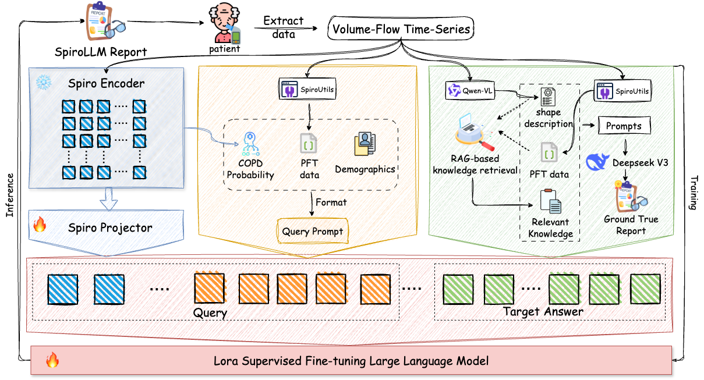

<div align="center">

  <h1>SpiroLLM: Finetuning Pretrained LLMs to Understand Spirogram Time Series with Clinical Validation in COPD Reporting</h1>

  <p>
    <a href="https://github.com/yudaleng/SpiroLLM">
      
    </a>
    <a href="https://huggingface.co/yudaleng/SpiroLLM">
      
    </a>
    <a href="http://creativecommons.org/licenses/by-nc-sa/4.0/">
      
    </a>
  </p>

  <a href="#">Shuhao Mei</a><sup>1,2,7</sup>,
  <a href="#">Yongchao Long</a><sup>2</sup>,
  <a href="#">Shan Cao</a><sup>3</sup>,
  <a href="#">Xiaobo Han</a><sup>4</sup>,
  <a href="#">Shijia Geng</a><sup>5</sup>,
  <a href="#">Jinbo Sun</a><sup>1,\*</sup>,
  <a href="#">Yuxi Zhou</a><sup>2,6,\*</sup>,
  <a href="https://hsd1503.github.io/">Shenda Hong</a><sup>7,\*</sup>

  <p>
  <sup>1</sup><a href="https://www.xidian.edu.cn/">Xidian University</a>
  <sup>2</sup><a href="https://www.tjut.edu.cn/">Tianjin University of Technology</a>
  <sup>3</sup><a href="https://www.tjmush.com.cn/index.shtml">The Second Hospital of Tianjin Medical University</a>
  <sup>4</sup><a href="https://www.301hospital.com.cn/index.html">Chinese PLA General Hospital</a>
  <sup>5</sup><a href="https://www.heartvoice.com.cn/about.html">HeartVoice Medical Technology</a>
  <sup>6</sup><a href="https://www.tsinghua.edu.cn/">Tsinghua University</a>
  <sup>7</sup><a href="https://www.pku.edu.cn/">Peking University</a>
  </p>
  
  <p><sup>*</sup>Corresponding Author</p>

  <p align="center">
      
  </p>

</div>


---

## Introduction
SpiroLLM is the **first** multimodal large language model specifically designed to interpret spirogram time-series data, providing diagnostic support for Chronic Obstructive Pulmonary Disease (COPD). By integrating raw spirometry signals with demographic information, SpiroLLM generates comprehensive and clinically relevant diagnostic reports.

---

## Quickstart

### 1. Setup Environment
First, create and activate a Conda virtual environment, then install the required dependencies.

```bash
# Create and activate the environment
conda create -n SpiroLLM python=3.11 -y
conda activate SpiroLLM

# Install all dependencies
pip install -r requirements.txt
````

### 2\. Prepare Demo Data

Run the provided script to automatically download the example spirometry data from the UK Biobank website. The data will be saved to the `data/` directory.

```bash
python generate_ukbb_demo_data.py
```

### 3\. Run Inference

Once the environment is set up and the data is downloaded, run the main inference script with the patient's information.

```bash
python main.py \
    --csv_path ./data/example.csv \
    --age 69 \
    --sex Male \
    --height_cm 176.0 \
    --is_smoker
```

The generated report will be printed to the console and saved to the output file specified in your `config.yaml`.

-----

## System Requirements

  - **Python**: 3.11
  - **PyTorch**: \>= 2.0
  - **GPU**: A CUDA-enabled GPU with at least **16 GB of VRAM** is required for the model to run properly.

-----

## Usage

The `main.py` script is the primary entry point for running inference. It requires the following command-line arguments:

| Argument | Type | Description | Required |
| :--- | :--- | :--- | :---: |
| `--csv_path` | `str` | Path to the patient's raw spirometry data file. | **Yes** |
| `--age` | `int` | The age of the patient in years. | **Yes** |
| `--sex` | `str` | The sex of the patient (`Male` or `Female`). | **Yes** |
| `--height_cm` | `float` | The height of the patient in centimeters. | **Yes** |
| `--is_smoker` | `flag` | Include this flag if the patient is a smoker. | No |
| `--ethnicity` | `str` | Patient's ethnicity. Defaults to `Caucasian`. | No |
| `--config` | `str` | Path to the configuration YAML file. | No |

-----

## Data Source

The data used in this project is sourced from the **UK Biobank**, a large-scale biomedical database and research resource. Access to the data is available to approved researchers upon application. For more information, please visit the [UK Biobank website](https://www.ukbiobank.ac.uk).

-----

## Relation to Prior Work
The `DeepSpiro` feature extractor, a key component of this project, is based on our prior work published in npj systems biology and applications:
```
Mei S, Li X, Zhou Y, et al. Deep learning for detecting and early predicting chronic obstructive pulmonary disease from spirogram time series[J]. npj Systems Biology and Applications, 2025, 11(1): 18.
```
The original implementation is available at the <a href="https://github.com/yudaleng/COPD-Early-Prediction">COPD-Early-Prediction GitHub repository</a>.

## License
This project is licensed under the Creative Commons Attribution-NonCommercial-ShareAlike 4.0 International License. To view a copy of this license, visit http://creativecommons.org/licenses/by-nc-sa/4.0/ or see the LICENSE file.